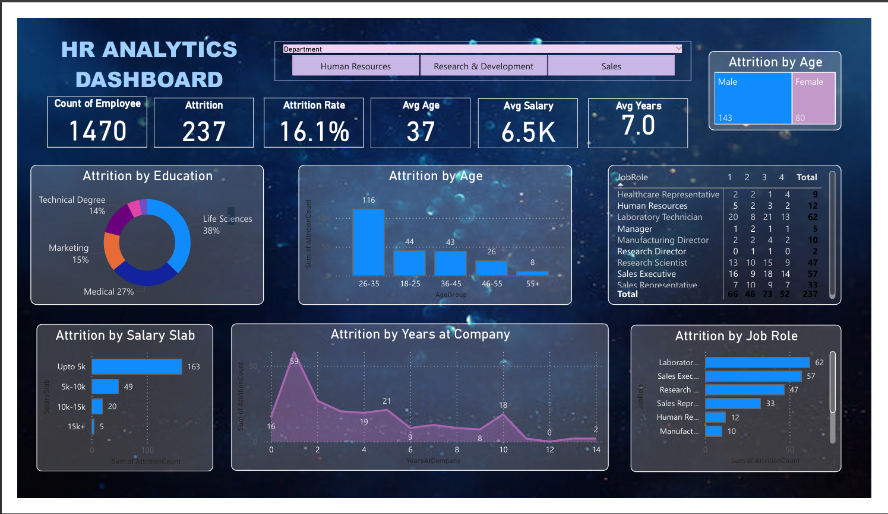

# HR_AnalyticsDashboard
# 🚀 HR Analytics Dashboard – Power BI Project

This project is a beginner-friendly end-to-end HR Analytics dashboard built in Power BI. It covers the full data analytics workflow from importing and cleaning data to visualizing key HR metrics.

---

## 📊 Project Overview

This dashboard project is created following a complete Power BI tutorial that walks through:
- Data import and preparation
- Data cleaning using Power Query
- DAX calculations and measures
- Creating KPIs, charts, tables
- Filters and slicers
- Exporting/sharing the dashboard

---

## 🔍 Dashboard Features

- Key Performance Indicators (KPIs)
- Visualizations: Bar Charts, Line Charts, Tables
- Interactive Filters & Slicers
- Export and share functionality

---

## 📸 Screenshots

---

## 🧠 Insights Gained

- Analyzed employee attrition, satisfaction, and work environment
- Identified trends in HR data to support business decisions
- Demonstrated the power of Power BI for storytelling with data

---
